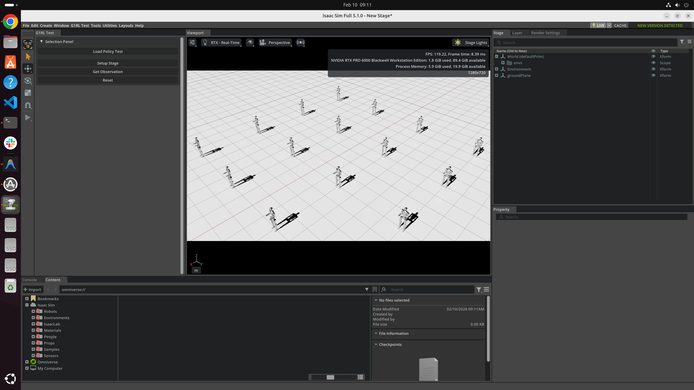

# G1RL

Training Unitree G1 Locomotion in NVIDIA Isaac Sim.



## Overview

G1RL is an NVIDIA Isaac Sim extension for training and testing locomotion policies on the [Unitree G1](https://www.unitree.com/g1/) humanoid robot. It provides a multi-environment reinforcement learning framework with 16 parallel simulation environments, enabling efficient policy training and evaluation.

## Features

- **Parallel Simulation**: 16 cloned environments with grid layout for batched RL training
- **Unitree G1 Model**: 29-DOF humanoid robot with 14 actively controlled joints (hip, waist, knee, ankle)
- **Observation Pipeline**: Body-frame projected gravity, angular velocities, joint positions/velocities, and 5-step history buffers
- **Policy Inference**: Load and run pre-trained TorchScript policies for locomotion control
- **Interactive UI**: Isaac Sim toolbar with buttons for scene setup, observation inspection, and task reset

## Project Structure

```
G1RL/
├── G1RL_Test_python/
│   ├── extension.py          # Isaac Sim extension entry point
│   ├── ui_builder.py         # Interactive UI panel
│   ├── locomotion_task.py    # RL task definition (env setup, obs, reward)
│   ├── g1.py                 # Unitree G1 robot wrapper
│   ├── policy.py             # MLP policy network
│   └── utils/
│       ├── circular_buffer.py  # Rolling history buffer
│       ├── math_utils.py       # Quaternion and tensor utilities
│       └── sim_config.py       # Physics simulation config
├── config/
│   └── extension.toml        # Extension metadata
├── data/                     # Icons and assets
├── docs/                     # Documentation
└── imgs/                     # Images
```

## Requirements

- NVIDIA Isaac Sim
- PyTorch (with CUDA)

## Getting Started

1. Clone the repository:
   ```bash
   git clone git@github.com:yizhouzhao/G1RL.git
   ```

2. Add the extension path to Isaac Sim's extension search paths.

3. Enable the **G1RL Test** extension from the Extension Manager.

4. Use the toolbar panel to:
   - **Setup Stage** — spawn 16 G1 robots in a grid layout
   - **Load Policy** — load a pre-trained locomotion policy
   - **Get Observation** — inspect the current observation vector
   - **Reset** — reset all environments

## TODO

- [ ] **Add reward and termination condition for the env**
  Define reward functions that encourage stable forward locomotion (e.g., tracking velocity commands, minimizing energy consumption, penalizing large joint torques and base oscillation). Implement termination conditions to detect falls, excessive tilt, or out-of-bounds states so that episodes reset automatically during training.

- [ ] **Add detailed Reinforcement Learning algorithm: PPO + GAE**
  Implement Proximal Policy Optimization (PPO) with Generalized Advantage Estimation (GAE) as the core training algorithm. This includes the clipped surrogate objective, value function learning, mini-batch updates over collected rollout trajectories, and GAE-based advantage computation with tunable lambda for bias-variance trade-off.

- [ ] **Add a standalone script to start training**
  Create a self-contained Python script that launches Isaac Sim in headless mode, instantiates the multi-environment locomotion task, initializes the PPO trainer, and runs the full training loop with periodic checkpointing, logging, and evaluation. This enables training without the extension UI.
